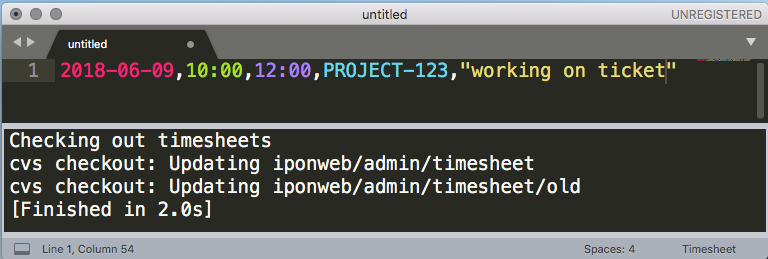
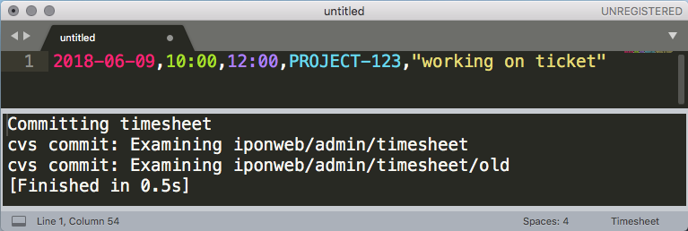

# Timesheets

Sublime Text 3 package to help working with IPONWEB timesheets.
Features:

* Syntax highlight;
* Can open ticket, that's under cursor, in browser;
* Can checkout and commit timesheets from Sublime Text
  (using Sublime's Build System);
* Help add new timesheet lines using single shortcut key;
* Show how much time is worked today and this week in status bar.


Both RT and Jira tickets are supported.

# Installation

Copy file `release/timesheets.sublime-package` into
`<data_path>/Installed Packages/` folder:

* `~/Library/Application Support/Sublime Text 3/Installed Packages/`
  (MacOS);
* `~/.config/sublime-text-3/Installed Packages/` (Ubuntu);
* `~/AppData/Roaming/Sublime Text 3/Installed Packages/` (Windows).

# Usage

## Syntax highlight

To use syntax highlight select Timesheet from right bottom menu
of available syntaxes, or type "Set syntax: Timesheet"
in command palette (`Ctrl+Shift+P`, or `Cmd+Shift+P` on Mac).

If timesheet line has invalid format, it won't be highlighted
(e.g. missing comma or quote, letter instead of digit etc).
There is one exception - "time to" field could be filled with spaces
and line is highlighted as valid. Because it's considered as
ticket you're working on right now and finish time is not known yet.

## Open ticket in browser

If line contains valid ticket, you could open it in browser by:

* `Ctrl+Click` (`Alt+Click` on Mac) on any place on line;
* Select `Goto Ticket` in context menu. This menu item
  is visible only if line contains valid ticket;
* Type "Goto Ticket" in command pallete
  (`Ctr+Shift+P`, or `Cmd+Shit+P` on Mac). This command is also
  visible only if line contains valid ticket.

## Checkout and commit

This feature works on top of already configured setup of CVS timesheets,
so it should be configured first as described in docs.

Checkout and commit are done as extension of standard
Sublime's Build System. It just executes CVS commands
that usually are executed manually.

There are several ways to perform checkout/commit:

* By hotkeys (customizable in settings):
  * Checkout: `Ctrl+Alt+I` ("incoming" thus "I");
  * Commit: `Ctrl+Alt+O` ("outgoing", thus "O").
* From `Tools` menu: `Tools → Timesheets: Checkout` or
  `Tools → Timesheets: Commit`;
* Using command palette: press `Ctr+Shift+P` (`Cmd+Shit+P` on Mac)
  and type "Timesheets: Checkout" or "Timesheets: Commit";
* Using Build System shortcuts: `Ctrl+Shift+B` (`Cmd+Shift+B` on Mac)
  and select "Timesheets - Checkout" or "Timesheets - Commit".
  "Timesheets" option performs checkout.

After command is run output panel with results will appear.





## Shortcut to add timesheet lines

In two words shortcut `Alt+D` (customizable) takes timesheet line
under the cursor, clones it, modifies to reflect current date/time
and appends it to proper place. Also it fills empty time_to field.

It's easier to describe it throught examples.
Suppose today is 2018-01-10 10:03, "|" represents cursor position.

Before:
```
2018-01-01,10:00,12:00,PROJECT-123,"working|"
```

After:
```
2018-01-01,10:00,12:00,PROJECT-123,"working"

2018-01-10,10:00,     ,PROJECT-123,"working|"
```

- New line is inserted as separator between days;
- Original issue and comment is copied;
- Today is inserted;
- Current time is rounded and inserted as time_from;
- time_to field is left blank.

Suppose now is 11:08.

Before:
```
2018-01-01,10:00,12:00,PROJECT-123,"working"

2018-01-10,10:00,     ,PROJECT-123,"working|"
```

After:
```
2018-01-01,10:00,12:00,PROJECT-123,"working"

2018-01-10,10:00,11:10,PROJECT-123,"working"
2018-01-10,11:10,     ,PROJECT-123,"working|"
```

- New line is not inserted because it's same day;
- Original issue and comment is copied;
- Empty time_to is filled with rounded current time;
- time_to of original line is inserted as time_from;
- time_to field is left blank.

There is another shortcut `Alt+Shift+D` which does all the same
but doesn't copy issue and comment.

Before:
```
2018-01-01,10:00,12:00,|PROJECT-123,"working"
```

After:
```
2018-01-01,10:00,12:00,PROJECT-123,"working"

2018-01-10,10:00,     ,|,""
```

These shortcuts work only with Jira lines.

## Info about how much time is worked today and this week in status bar

This info is shown automatically.
Updating is triggered by following events:
* Tab activation (by switching to timesheet file from another tab,
  or by switching to Sublime window with opened timesheet
  from another window);
* File save.

Examples: `Worked today 02:35, week 10:35` (hours:minutes).

If timesheet line has empty time_to field,
it's considered as current time.

# Customization

Plugin has few URLs settings accessible in
`Preferences → Package Settings → Timesheets → Settings`:

```javascript
{
    // Request Tracker (RT) ticket URL, e.g.
    // "https://rt.example.com/Ticket/Display.html?id={}"
    "rt_ticket_url": "https://www.iponweb.net/rt/Ticket/Display.html?id={}",

    // Jira ticket URL, e.g.
    // "https://jira.example.com/browse/{}"
    "jira_ticket_url": "https://jira.iponweb.net/browse/{}"
}
```

Mouse bindings could be changed in
`Preferences → Package Settings → Timesheets → Mouse Bindings`:

```javascript
[
    {
        "button": "button1",
        "modifiers": ["alt"],
        "count": 1,
        "press_command": "drag_select",
        "command": "goto_ticket"
    }
]
```

Key bindings could be changed in
`Preferences → Package Settings → Timesheets → Key Bindings`:

```javascript
[
    {
        "keys": ["ctrl+alt+i"],
        "command": "timesheets_checkout"
    },
    {
        "keys": ["ctrl+alt+o"],
        "command": "timesheets_commit"
    },

    {
        "keys": ["alt+d"],
        "command": "duplicate_timesheet_line",
        "args": {
            "copy_issue_and_comment": true
        }
    },
    {
        "keys": ["alt+shift+d"],
        "command": "duplicate_timesheet_line",
        "args": {
            "copy_issue_and_comment": false
        }
    }
]
```